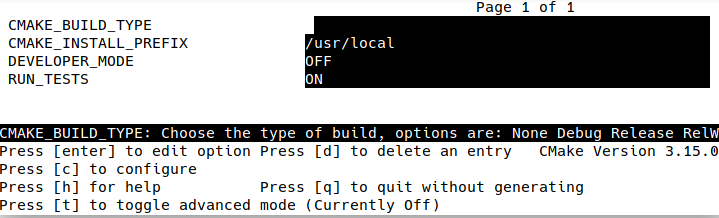
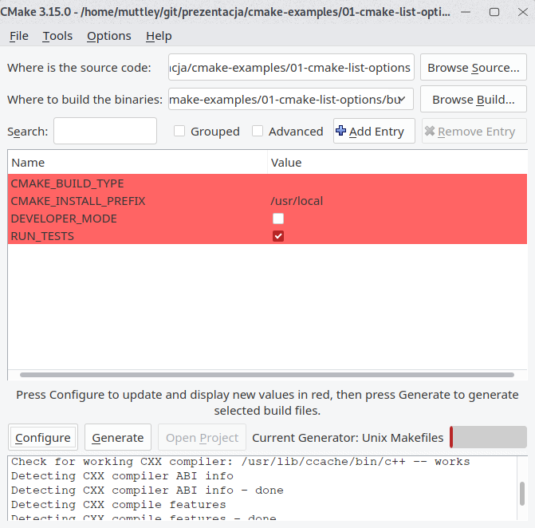
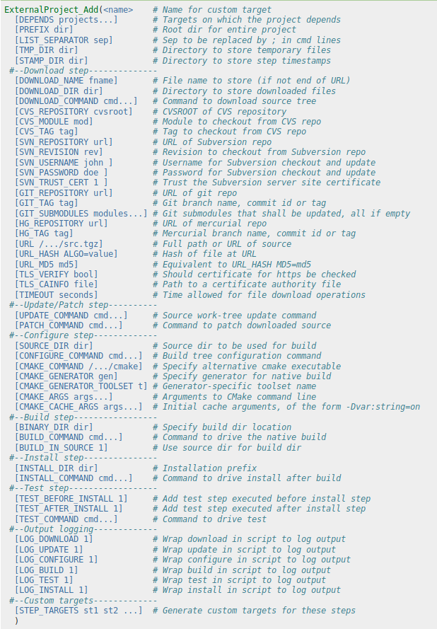
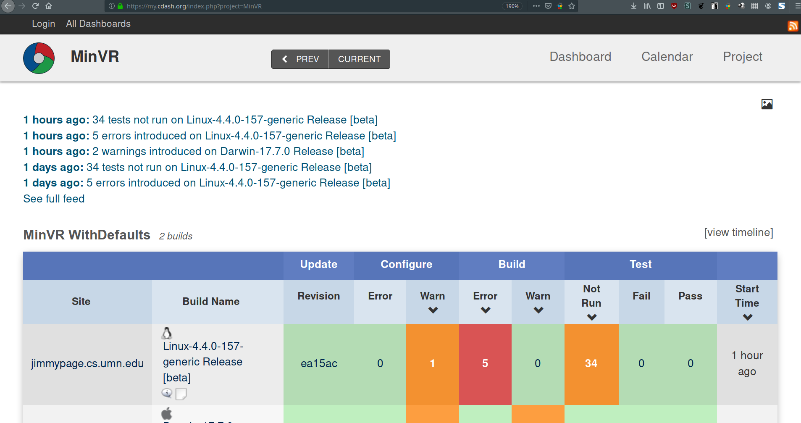
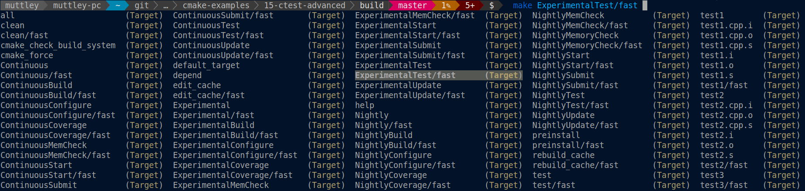

class: title-slide

# CMake

## from zero to something

---

# Plan

--

.left-column[
- Basic usage as user
- Basic usage as developer
- Things to know before you get into it
- Structuring your CMake source code
- Modern CMake, what's the fuss about?
- Integration with external tooling
- CTest && CPack
- C++ bonus at the end
]

---
class: title-slide

# Basic usage as user

---

# Basic usage as user - generating and building

--

## Generating Makefile/Visual Studio solution

.left-column[
```
cd ~/git/repository
mkdir build
cd build
cmake .. -DCMAKE_BUILD_TYPE=Debug
```

## Starting the build

```
cmake --build .
```

or

```
make
```
]

--

.right-column[
.info[
.center[
_NEVER_, simply _NEVER_ do in-source builds.

Always create a build sub-directory or do out-of-source builds.


CMake generates its files in current working directory.
]
]
]

---

# Basic usage as user - parameters

- Passing flags to CMake:

  ```
  cmake .. -DCMAKE_CXX_FLAGS="-fsanitize=address"
  ```

- Generic:

  ```
  cmake .. -DCMAKE_<LANG>_FLAGS="<FLAGS>"
  ```

.info[
_Useful parameters_:
```cmake
CMAKE_BUILD_TYPE       # Debug|Release|MinSizeRel|RelWithDebInfo
CMAKE_CXX_COMPILER     # g++, clang++, ?
CMAKE_EXE_LINKER_FLAGS # -static-libstdc++
```
]

---

# Basic usage as user - setting options

## Setting options
  ```
  cmake .. -DBUILD_STATIC=ON 
  ```

--

## How do I know what options are there?

--

  ```
  cmake -LH ..            # CLI
  cmake .. && ccmake .    # curses-based UI
  cmake-gui ..            # GUI
  ```

---

# Basic usage as user - list options - CLI

_../CMakeLists.txt_

```cmake
cmake_minimum_required(VERSION 3.1)
project(cmake_example_01)
option(RUN_TESTS "Build tests with GoogleTest" ON)
option(DEVELOPER_MODE "Enable checks useful to developers" OFF)
```

_in build directory_

```
$ cmake -LH ..
# <clobber>
// Enable checks useful to developers
DEVELOPER_MODE:BOOL=OFF

// Build tests with GoogleTest
RUN_TESTS:BOOL=ON
```

---

# Basic usage as user - list options - ccmake

```
$ ccmake ..
```

.center[

]

---

# Basic usage as user - list options - cmake-gui

```
$ cmake-gui
```

.center[

]

---
class: title-slide

# Basic usage as developer

---

# Basic usage as developer - minimal template for starting

--

_CMakeLists.txt_

```cmake
cmake_minimum_required(VERSION 3.1)
project(my_project)

add_executable(main main.cpp)
```

---

# Basic usage as developer - setting flags

--

```cmake
set(CMAKE_CXX_FLAGS "${CMAKE_CXX_FLAGS} -pedantic")
```

--

## or

```cmake
target_compile_options(main PRIVATE "-pedantic")
```

--

.info[
Second approach is more modern, but we'll get to it later
]

---

# Basic usage as developer - include directories

--

```cmake
include_directories("dir/some_nice_library/include")
```

--

## or

```cmake
target_include_directories(main PRIVATE "dir/some_nice_library/include")
```

--

## or

```cmake
target_include_directories(main SYSTEM PRIVATE "dir/some_nice_library/include")
```

--
.info[
What PRIVATE does? We’ll get to it later ;)
]

---

# Basic usage as developer - linking libraries

--

```cmake
link_directories("dir/spooky_scary_lib/lib")
target_link_libraries(main PRIVATE spooky_scary_lib)
```

--

## or

```cmake
target_link_directories(main PRIVATE "dir/spooky_scary_lib/lib")
target_link_libraries(main PRIVATE spooky_scary_lib)
```

---

# Basic usage as developer - summing up

--

```cmake
cmake_minimum_required(VERSION 3.1)
project(my_project)

set(CMAKE_CXX_FLAGS "${CMAKE_CXX_FLAGS} -pedantic")

add_executable(main main.cpp)
target_include_directories(main PRIVATE "dir/some_nice_library/include")
target_link_directories(main PRIVATE "dir/spooky_scary_lib/lib")
target_link_libraries(main PRIVATE spooky_scary_lib)
```

--

.info[
This simple example allows us to get ourselves a very basic, but extendable buildsystem
]

---
class: title-slide

# Things to know before you get into it

---

# Things to know

--

## What can we create?

--

Targets

--

```cmake
add_executable(main main.cpp)
add_library(one SHARED somelib.cpp) #.so or .dll
add_library(two STATIC someotherlib.cpp) #.a or .lib
add_library(three OBJECT object.cpp) #.o
add_library(externallib IMPORTED)
add_custom_command(...)
add_custom_target(...)
```

---

# Things to know

--

## There are no return values from functions

--

```cmake
function(give_me_five)
  return (5) # ERROR
endfunction()
```

--

## Only way to return are output parameters

--

```cmake
function(give_me_five OUTPUT_VARIABLE)
  set(${OUTPUT_VARIABLE} 5 PARENT_SCOPE)
endfunction()
```

---

# Things to know

--

## Everything is a string!

--

```cmake
set(CMAKE_CXX_STANDARD 17)
```

--

```cmake
if ("23" LESS 24) # both treated as a string, LESS knows how to compare integers
```

--

```
set(somelist "")
list(APPEND somelist ";")
list(APPEND somelist ";")
list(APPEND somelist ";")
list(APPEND somelist ";")
list(APPEND somelist ";")
list(APPEND somelist ";")
message("somelist: ${somelist}") # Prints: ;;;;;;;;;;;;
list(LENGTH somelist somelist_LENGTH)
message("len: ${somelist_LENGTH}") # Prints: 12
```

---

# Things to know - _Everything is a string!_

.info[
.center[
We need to validate arguments heavily,

or we will end up with cryptic errors
]
]

---

# Things to know

--

## Validating arguments: what if we don't

--

```cmake
if (${ARCH} STREQUAL "ARM") # ARCH is unset
```

--

## this will expand to:

```cmake
if ( STREQUAL "ARM")
```

--

## so let's run CMake

--

```
$ cmake ..
<typical output of CMake>
CMake Error at CMakeLists.txt:17 (if):
  if given arguments:
    "STREQUAL" "ARM"
  Unknown arguments specified
```

---

# Things to know - validating arguments

--

## We should always check for empty or invalid arguments

--

## Remember this function?

```cmake
function(give_me_five OUTPUT_VARIABLE)
  set(${OUTPUT_VARIABLE} 5 PARENT_SCOPE)
endfunction()
```

--

## We can write it better!

--

```cmake
function(give_me_five OUTPUT_VARIABLE)
  if (NOT "${OUTPUT_VARIABLE}" STREQUAL "")
    set(${OUTPUT_VARIABLE} 5 PARENT_SCOPE)
  endif()
endfunction()
```

---

# Things to know - validating arguments

--

## What will happen?

--

```cmake
set("" XD)
```

---
class: title-slide

# Code structuring

---

# _Code structuring_

--

- CMake is a _programming language_

--

- We have macros, functions and variables

--

    _and we can shoot our feet with it_

--

- If we remember some principles (_everything is a string_, _no return values_, _scopes_) then we can be successful with them

--

- _functions.cmake_ is a good place to place our verbose functions

---

# _Code structuring_

--

## What is a function?

--

```cmake
function(name INPUT_PARAM1)
  message("INPUT_PARAM1: ${INPUT_PARAM1}")
  message("arg count: ${ARGC}")
  message("all args: ${ARGV}")
  message("optional args: ${ARGN}")
endfunction()
```

--

## We can call it

```cmake
name(HELLO THERE)
```

--

```
INPUT_PARAM1: HELLO
arg count: 2
all args: HELLO; THERE
optional args: THERE
```

---

# Code structuring - _function versus macro_

--

- Function has it's own scope, so if you want to return from function you'll need to use output variable with PARENT_SCOPE option

```cmake
function(give_me_somevalue OUTPUT_VAR)
  set("${OUTPUT_VAR}" "somevalue" PARENT_SCOPE)
endfunction()
```

--

- Macro is almost the same as function, but it doesn’t have it’s own scope – all variables you use will get populated to caller. This may be undesired and cause clutter in variables.

```cmake
macro(give_me_somevalue OUTPUT_VAR)
  set("${OUTPUT_VAR}" "somevalue")
endmacro()
```

--

---

# _Code structuring_

--

## Do not be afraid to create helper functions

--

```cmake
if ("${CMAKE_CXX_COMPILER_ID}" STREQUAL "Clang")
  if("${CMAKE_CXX_COMPILER_VERSION}" VERSION_GREATER "5.0")
    set(CMAKE_CXX_FLAGS "${CMAKE_CXX_FLAGS} -Wno-gnu-zero-variadic-macro-arguments")
  endif()
endif()
```

--

```cmake
add_flags_to_compiler(COMPILER_ID Clang
                      VERSION_GREATER 5.0
                      FLAGS "-Wno-gnu-zero-variadic-macro-arguments")
```

---

# _Code structuring_

## Parsing arguments

--

```cmake
function create_test(NAME SOURCES INCLUDES LINK_LIBS FLAGS)
```

--

```cmake
create_test(testing_file_under_test
            "tests/test.cpp ${SOURCE_DIR}/src/file_under_test.cpp"
            "${SOURCE_DIR}/include"
            "restbed pthread"
            "-fprofile-arcs -ftest-coverage")
```

--

## We can do better!

---

# Code structuring - _Parsing arguments_

--

## cmake_parse_arguments

```cmake
function create_test() #declaration doesn’t give us much info
  set(options "EXCLUDE_FROM_BUILD")
  set(oneValArgs "NAME")
  set(multiValArgs SOURCES INCLUDES LINK_LIBS FLAGS)
  cmake_parse_arguments(CT "${options}" "${oneValArgs}" "${multiValArgs}" ${ARGN})
  # we can access them under ${CT_NAME} ${CT_FLAGS}
endfunction()

create_test(NAME      testing_file_under_test
            SOURCES   tests/test.cpp
                      ${SOURCE_DIR}/src/file_under_test.cpp
            INCLUDES  ${SOURCE_DIR}/include
            LINK_LIBS restbed pthread
            FLAGS     "-fprofile-arcs -ftest-coverage")
```

---
class: title-slide

# Modern CMake

## What's the fuss about?

---

# _Modern CMake_

--

## What is the big change of _CMake 3_?

--

## Target-based approach

--

## Still _everything is a string_, but at least those strings are hidden behind targets. This allows for more object-oriented buildsystem generation.

---

# _Modern CMake_

## How to write modern CMake?

--

- Use targets and their properties
- Use access modifiers
- Do not use global variables
- _AVOID_ FILE(_GLOB_ ...)
- Use target aliases
- Obtain your dependencies in a consistent & maintainable way

---

# Modern CMake - _use targets and their properties_

## _CMake 3.0_* introduced new alternatives to functions related to _including_ and _linking_ libraries

--

.left-column[
_CMake 2.8_

```cmake
add_library(lib1 SHARED lib1.cpp)
include_directories(lib1/include)
link_directories(lib1/lib)
# (lib2 .. lib19)
add_library(lib20 SHARED lib20.cpp)
include_directories(lib20/include)
link_directories(lib20/lib)

add_executable(main main.cpp)
target_link_libraries(main lib1)
```

```
g++ -Ilib1/include -Ilib2/include -Ilib3/include -Ilib4/include -Ilib5/include -Ilib6/include -Ilib7/include -Ilib8/include -Ilib9/include -Ilib10/include -Ilib11/include -Ilib12/include -Ilib13/include -Ilib14/include -Ilib15/include -Ilib16/include -Ilib17/include -Ilib18/include -Ilib19/include -Ilib20/include -Llib1/lib -Llib2/lib -Llib3/lib -Llib4/lib -Llib5/lib -Llib6/lib -Llib7/lib -Llib8/lib -Llib9/lib -Llib10/lib -Llib11/lib -Llib12/lib -Llib13/lib -Llib14/lib -Llib15/lib -Llib16/lib -Llib17/lib -Llib18/lib -Llib19/lib -Llib20/lib -llib1 main.cpp
```
]

--

.right-column[
_CMake 3_

```cmake
add_library(lib1 SHARED lib1.cpp)
target_include_directories(lib1 PUBLIC lib1/include)
target_link_directories(lib1 PUBLIC lib1/lib)
# (lib2 .. lib19)
add_library(lib20 SHARED lib20.cpp)
target_include_directories(lib20 PUBLIC lib20/include)
target_link_directories(lib20 PUBLIC lib20/lib)

add_executable(main main.cpp)
target_link_libraries(main PRIVATE lib1)
```

```
g++ -Ilib1/include -Llib1/lib -llib1 main.cpp
```
]

---

# Modern CMake - _Access modifiers_

--

## Used with functions starting with _target__

--

- PRIVATE
- INTERFACE
- PUBLIC

--

.info[
.center[
Access modifiers mainly impact _target_link_libraries_ function
]
]

---

# Modern CMake - Access modifiers - _PRIVATE, INTERFACE, PUBLIC_

--

.left-column[
```cmake
add_library(lib1 STATIC lib1.cpp)
target_include_directories(lib1 PRIVATE
                           external/lib/include)

add_executable(main main.cpp)
target_link_libraries(main PRIVATE lib1)
```

```
g++ lib1.cpp -Iexternal/lib/include
g++ main.cpp -l(...)/build/lib1.a
```
]

--

.right-column[
```cmake
add_library(lib1 STATIC lib1.cpp)
target_include_directories(lib1 INTERFACE
                           external/lib/include)

add_executable(main main.cpp)
target_link_libraries(main PRIVATE lib1)
```

```
g++ lib1.cpp
g++ main.cpp -Iexternal/lib/include \
             -l(...)/build/lib1.a
```
]

--

<br/><br/><br/><br/><br/><br/><br/><br/>

```cmake
add_library(lib1 STATIC lib1.cpp)
target_include_directories(lib1 PUBLIC external/lib/include)

add_executable(main main.cpp)
target_link_libraries(main PRIVATE lib1)

g++ lib1.cpp -Iexternal/lib/include
g++ main.cpp -Iexternal/lib/include -l(...)/build/lib1.a
```

---

# Modern CMake - _Avoiding global variables_

--

## We can't avoid using global variables in CMake, but at least we can minimize their usage count.

--

.info[
Global variables could be an easy source of mistakes.
]

---

# Modern CMake - _Avoiding global variables_

--

If we would want to enable warnings on GCC compiler, we would use _-Wall_ flag for that

--

Simple attempt would be:
```cmake
set(CMAKE_CXX_FLAGS "-Wall")
```

--

## What is the problem with that call?
--

## It will discard all user provided flags

```cmake
cmake .. -DCMAKE_CXX_FLAGS="-fsanitize=address"
```

---

# Modern CMake - _Avoiding global variables_

## How can we solve it?

--

- Good

```cmake
set(CMAKE_CXX_FLAGS "${CMAKE_CXX_FLAGS} -Wall")
```

--

- Better

```cmake
string(APPEND CMAKE_CXX_FLAGS " -Wall")
```

--

- The best

```cmake
target_compile_options(main PRIVATE "-Wall")
```

---

# Modern CMake - _AVOID FILE(GLOB ...)_

--

```cmake
file(GLOB SOURCES src/*.cpp)
```

--

```
$ ls src/
main.cpp lib1.cpp
$ mkdir build; cd build
$ cmake .. # SOURCES == main.cpp, lib1.cpp
$ echo "<somecode>" >lib2.cpp
$ make
```

--

## _main.cpp_ and _lib1.cpp_ will get compiled, _lib2.cpp_ will be left out

.info[
To regenerate CMake's GLOB cache run:
```cmake
make rebuild_cache
```
]

---

# Modern CMake - _Use target aliases_

--

## Target alias allows you to give imported library sanitized name.

--

## Many of CMake modules do not follow any convention regarding naming imported libraries.

--

```cmake
find_package(SomeGUILib)
target_link_libraries(main PRIVATE SomeGUI::Widgets SomeGUI::Network)
```

```cmake
find_package(OtherLib)
target_link_libraries(main PRIVATE other_lib_main other_lib)
```

--

## Solution?

--

```cmake
add_library(Other::Lib ALIAS other_lib)
```

---

# Modern CMake - _Obtaining dependencies_

## What are our options?

--

- Have them installed in system (_Docker_/_VM_/_Yocto_)

--

- Included in repository - subdirectory/_git submodule_

--

- _ExternalProject_Add_

--

- _conan_, _hunter_, _vcpkg_ and others - package managers

---

# Modern CMake - Obtaining dependencies - _Submodule_

```
$ git submodule add https://github.com/google/googletest.git
```

```cmake
add_subdirectory(googletest EXCLUDE_FROM_ALL)
```

## Pros:

- No additional dependencies

## Cons:

- They take up space in your repository (subdirectory)
- Nested submodules can result in unmaintainable mess
- Vulnerable to CMake-clutter (ex. oktal/pistache leaks cppcheck)

---

# Modern CMake - Obtaining dependencies - _ExternalProject_

--

## Pros:

- relatively simple
- no additional dependencies (if we’re using CMake already)
- versatile (can get our dependency from CVS, SVN, Git, Mecurial, zip, tar and probably others)
- CMake-clutter proof

--

## Cons:

- requires CMake-Fu
- a lot of lines to set anything up

---

# Modern CMake - Obtaining dependencies - _ExternalProject_

.left-column[
## CMake-Fu ?

- 53 optional parameters
- workarounds will be required:
    - [HTTP_PROXY on Windows](https://github.com/pmem/pmdk-tests/blob/master/functions.cmake#L51)
]

.right-column[

]

---

# Modern CMake - Obtaining dependencies - _ExternalProject_

.small[
```cmake
function(download_gtest)
	include(ExternalProject)
	set(GTEST_VERSION 1.8.0)
	set(GTEST_SHA256HASH f3ed3b58511efd272eb074a3a6d6fb79d7c2e6a0e374323d1e6bcbcc1ef141bf)
	
	set(GTEST_URL https://github.com/google/googletest/archive/release-${GTEST_VERSION}.zip)
	
	ExternalProject_Add(
	    gtest
	    URL ${GTEST_URL}
	    URL_HASH SHA256=${GTEST_SHA256HASH}
	    DOWNLOAD_NAME googletest-${GTEST_VERSION}.zip
	    DOWNLOAD_DIR ${CMAKE_SOURCE_DIR}/external/gtest
	    PREFIX ${CMAKE_CURRENT_BINARY_DIR}/external/gtest
	    LOG_INSTALL 0
	    INSTALL_COMMAND ""
	    CMAKE_ARGS -DCMAKE_C_COMPILER=${CMAKE_C_COMPILER} -DCMAKE_CXX_COMPILER=${CMAKE_CXX_COMPILER} -DCMAKE_CXX_FLAGS="-Wno-deprecated-copy"
	)
	
	# CMake is beautiful - https://gitlab.kitware.com/cmake/cmake/issues/15052
	file(MAKE_DIRECTORY "${CMAKE_CURRENT_BINARY_DIR}/external/gtest/src/gtest/googletest/include")
	
	add_library(libgtest STATIC IMPORTED GLOBAL)
	target_include_directories(libgtest SYSTEM INTERFACE "${CMAKE_CURRENT_BINARY_DIR}/external/gtest/src/gtest/googletest/include")
	target_link_libraries(libgtest INTERFACE pthread)
	set_target_properties(libgtest PROPERTIES
	                      IMPORTED_LOCATION "${CMAKE_CURRENT_BINARY_DIR}/external/gtest/src/gtest-build/googlemock/gtest/libgtest.a")
	
	add_library(libgtest_main STATIC IMPORTED GLOBAL)
	target_include_directories(libgtest_main SYSTEM INTERFACE "${CMAKE_CURRENT_BINARY_DIR}/external/gtest/src/gtest/googletest/include")
	target_link_libraries(libgtest INTERFACE pthread)
	set_target_properties(libgtest_main PROPERTIES
	                      IMPORTED_LOCATION "${CMAKE_CURRENT_BINARY_DIR}/external/gtest/src/gtest-build/googlemock/gtest/libgtest_main.a")
	
	add_dependencies(libgtest gtest)
	add_dependencies(libgtest_main gtest)
endfunction()
```
]

---

# Modern CMake - Obtaining dependencies - _Package managers_

--

## Pros:

- simplest to use when they are working
- may have prebuilt packages

--

## Cons:

- will there be package X?
- external dependencies (ex. Python)

---

# Obtaining dependencies - _Package managers_ - _Conan_

## Better described at Wro.cpp #10

--

```
pip install conan
conan search "gtest*" --remote=conan-center
optional: conan inspect <package>
create conanfile.txt
  [requires]
  gtest/1.8.1@bincrafters/stable
  [generators]
  cmake
mkdir build && cd build
conan install .. [--build gtest]
```

--

```cmake
include(${CMAKE_BINARY_DIR}/conanbuildinfo.cmake)
conan_basic_setup(TARGETS TRUE) # Important for Modern CMake

target_link_libraries(tests PRIVATE CONAN_PKG::gtest)
```

---

# Obtaining dependencies - _Package managers_ - _Conan_

--

## Conan isn’t exactly modern CMake:

--

- Disturbs ‘standard’ flow of using CMake – you need to call _conan install_ first

--

- Exports a lot of global variables

--

- Modifies global variables (so using _Conan_ can change our build flags)

--

- Default uses variables instead of targets (_${CONAN_LIBS}_ instead of _CONAN_PKG::gtest_)

--

- Creating profiles for other compiles isn't exactly simple, but it's supported

---

# Obtaining dependencies - _Package managers_ - _Hunter_

- Download HunterGate.cmake to your project

```cmake
cmake_minimum_required(VERSION 3.1)

include(HunterGate.cmake)

HunterGate(
    URL "https://github.com/cpp-pm/hunter/archive/v0.23.222.tar.gz"
    SHA1 "0b88baaa2a9a35b8ce632c57ade66be8dd918afd"
)

project(hunter-test)

include(hunter_cmake_args)
hunter_add_package(GTest)
find_package(GTest CONFIG REQUIRED)

add_executable(main main.cpp)
target_link_libraries(main PRIVATE GTest::gtest GTest::main)
```

---

# Obtaining dependencies - _Package managers_ - _Hunter_

## Pros:

- modern, beautiful, short
- no external dependencies
- can do what ExternalProject does

--

## Cons:

- it doesn't work...
--
  but seriously, it's so modern, that it is unhackable
- maintainer problems: [#1921](https://github.com/ruslo/hunter/issues/1921)

---

# Obtaining dependencies - _Package managers_ - _vcpkg_

--

- Install vcpkg

```
vcpkg install gtest
```

--

- Add code to CMakeLists.txt

```cmake
find_package(GTest MODULE REQUIRED)
target_link_libraries(main PRIVATE GTest::GTest GTest::Main)
```

--

- Call CMake:

```
cmake .. -DCMAKE_TOOLCHAIN_FILE=/usr/share/vcpkg/scripts/buildsystems/vcpkg.cmake
```

---

# Obtaining dependencies - _Package managers_ - _vcpkg_

--

## Pros:

- Clean and modern
- Probably least painful from all I tested

--

## Cons:

- needs some kind of profile-environment

---
class: title-slide

# Integration with external tooling

---

# _Integration with external tooling_

## Why? Convenience

--

- gcovr for coverage reports
- clang-format/astyle for automatic style checking
- clang-tidy

---

# Integration with external tooling - _gcovr_

--

## Needs _gcovr_ to be installed in host system

--

.small[
```cmake
option(RUN_COVERAGE "Run tests with Coverage" OFF)
if (RUN_COVERAGE)
  string(APPEND CMAKE_CXX_FLAGS " -fprofile-arcs -ftest-coverage")
  find_program(GCOVR gcovr)
  if (NOT GCOVR)
    message(FATAL_ERROR "gcovr is not installed")
  endif()

  add_custom_target(coverage_report
                    COMMAND ${CMAKE_COMMAND} -E remove_directory "${CMAKE_BINARY_DIR}/coverage"
                    COMMAND ${CMAKE_COMMAND} -E make_directory "${CMAKE_BINARY_DIR}/coverage"
                    COMMAND ${GCOVR} -r \"${CMAKE_SOURCE_DIR}\" --html -o \"${CMAKE_BINARY_DIR}/coverage/coverage.html\" --html-details)
endif()

add_executable(main main.cpp)
```
]

--

```
cmake .. -DRUN_COVERAGE=ON
make
./main
make coverage_report
xdg-open coverage/coverage.html
```

---

# Integration with external tooling - _clang-format_

## Analogously we can do the same to clang-format, though it’s better to use an external Bash/Powershell script for this – amount of CMake code can quickly get unmanagable.

```cmake
add_custom_target(style-check
  ALL
  COMMAND format.sh check ${CMAKE_SOURCE_DIR}/src)
add_custom_target(style-format
  COMMAND format.sh format ${CMAKE_SOURCE_DIR}/src)
```

---

# Integration with external tooling - _clang-tidy_

## It’s a little better with clang-tidy, yet _CMake-Fu_ strikes us again

--

## CMake will _silently ignore_ this if anything is incorrect

--

## _CMake >= 3.6_, otherwise do as with clang-format

--

## Needs to be done _before_ defining any target:

```cmake
set(CMAKE_CXX_CLANG_TIDY "clang-tidy;-checks=*")
```

---
class: title-slide

# CTest && CPack

---

# _CTest_

--

## CTest is CMake’s integrated test runner

- Two ways to use, basic (without module):

--

```cmake
enable_testing() #You have to call it in every directory
add_test(<TEST_NAME> <BINARY_NAME> [<ARGS>])
```

--

```
ctest [-V] [--output-on-failure]
```

## or

```
make test
```

---

# _CTest advanced mode_

--

.left-column[
```cmake
include(CTest)
add_test(<TEST_NAME> <BINARY_NAME> [<ARGS>])
```

## Main selling point is CDash support
]

--

.right-column[

]

---

# _CTest advanced mode_

--

- Exports a bunch of targets, which propagate through _add_subdirectory_



--

- Supports 'advanced pipelines' through scripts

--

- Can run your tests with Valgrind without any additional setup

--

- 2010 CI feeling

---

# _CPack_

--

## _CPack_ allows you to create cross-platform installer for your program

--

## It can output various installers and packages, ex. _DEB_, _STGZ_ (self extracting SH), _NSIS_ (.exe installer), _RPM_, _ZIP_,_TGZ_

---

# _CPack_ - code example

--

```cmake
cmake_minimum_required(VERSION 3.1)
project(cpack-example)

add_library(lib STATIC src/lib.cpp src/lib.hpp)
add_executable(main src/main.cpp)
target_link_libraries(main PRIVATE lib)

install(TARGETS main DESTINATION bin)

set(CPACK_PACKAGE_VERSION_MAJOR "1")
set(CPACK_PACKAGE_VERSION_MINOR "0")
set(CPACK_PACKAGE_VERSION_PATCH "0")
set(CPACK_PACKAGE_CONTACT "some contact")

include(CPack)
```

--

```
cmake .. -DCPACK_GENERATOR=STGZ
make
make package
```

---
class: title-slide

# C++ bonus at the end

---

# C++ - _reflection_

--

## Library which allows us to iterate over structs: [cbeck88/visit_struct](https://github.com/cbeck88/visit_struct)

```
struct my_type {
  int a;
  float b;
  std::string c;
};
VISITABLE_STRUCT(my_type, a, b, c);
my_type object{};

visit_struct::for_each(object, [](char const* name, auto& value) {});
```

---

# C++ - _reflection_

## Two ways to iterate over structures

- C++11

```
struct printer {
  template <typename T>
  void operator()(char const* name, T const& value) {
    std::cout << name << " = " << value << '\n';
  }
};

void print(my_type const& object) {
  visit_struct::for_each(object, printer{});
}
```

---

# C++ - _reflection_

## Two ways to iterate over structures

- C++14 and above

```
void print(my_type const& object) {
  visit_struct::for_each(object,
    [](char const* name, auto const& value) {
      std::cout << name << " = " << value << '\n';
    });
}
```

## [https://godbolt.org/z/aDEoUT](https://godbolt.org/z/aDEoUT)

---

# C++ - _reflection_

## Can we disassemble this with one function and parse it to JSON?

```
struct big_struct {
   int value;
   struct t_nested
   {
      int value;
      int second;
   } nested[5];
   char name[40];
};
```

---

# C++ - _reflection_

--

.medium[
```
VISITABLE_STRUCT(big_struct::t_nested, value, second);
VISITABLE_STRUCT(big_struct, value, nested, array, name);

template <typename T>
nlohmann::json visit(T const& object)
{
  nlohmann::json output;
  visit_struct::for_each(object, [&output](const char* name, auto& value)
  {
    using value_type = std::remove_const_t<std::remove_reference_t<decltype(value)>>;

    if constexpr (std::is_array_v<value_type>)
    {
      using array_type = typename std::remove_all_extents<value_type>::type;
      if constexpr (std::is_class_v<array_type>)
        for (auto const &i : value)
          output[name].push_back(visit(i));
      else
        output[name] = value;
    }
    else if constexpr (std::is_same_v<value_type, int>)
      output[name] = value;
    else if constexpr (std::is_class_v<value_type>)
      output[name] = visit(value);
  });
  return output;
}
```
]

## [https://godbolt.org/z/rrM3zn](https://godbolt.org/z/rrM3zn) | [https://godbolt.org/z/14hpqu](https://godbolt.org/z/14hpqu)

---
# What next?

--

## Optimizing _CMake_ performance (generation and build)

--

##  _Bazel_/_Meson_/any other buildsystem

--

## _Local CI_ env with _coverage_ and _sanitizers_

---

class: title-slide

# Questions?

## https://github.com/muttleyxd/talks

---
